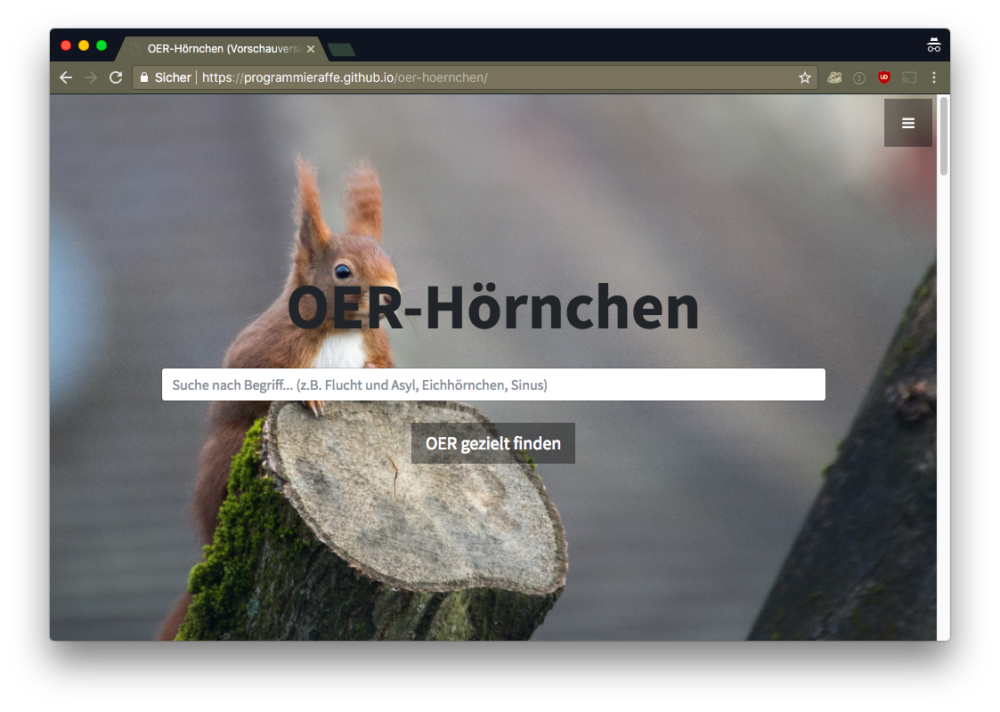
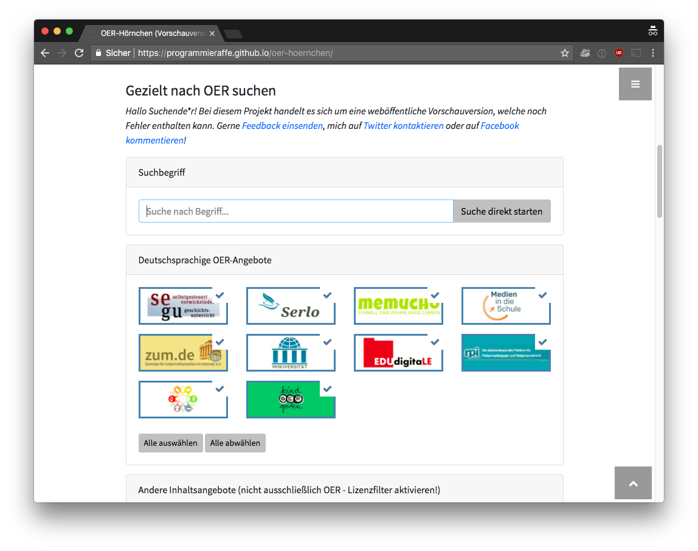

# OERhörnchen (oer-squirrel)
:squirrel: OER (Open Educational Resources) gezielt suchen und finden.

THIS IS THE OLD HTML-ONLY REPOSITORY. NEW PAGE SOURCE CAN BE FOUND HERE:
https://github.com/programmieraffe/oerhoernchen

:warning: quick&dirty coding

__[https://www.oerhoernchen.de](https://www.oerhoernchen.de)__

Entwicklervorschau: [https://programmieraffe.github.io/oer-hoernchen/](programmieraffe.github.io/oer-hoernchen/)

English description: OER is sometimes hard to find in a messy and massive world wide web. This is an open experiment to use the "site:"-operator of the google search (There is also Google custom search service, but I did not found a way to filter the results by open license). The technical limitation right now is the 32-word-limit for Google search queries. Feel free to fork and edit it for your own purposes, feedback is greatly appreciated (I'll will provide a translated version as well in near future).

Eine ausführliche deutsche Beschreibung findet sich in der Online-Version: [https://www.oer-hoernchen.de]

Feedback sehr gerne als Issue eintragen!

## Screenshots

## Features
- auf bestimmten Webseiten nach CC-lizenzierten Inhalten suchen
- funktioniert mit Github Pages, kein eigenes Webhosting nötig / runs on Github Pages (only HTML5/CSS/JS)

## Mitmachen? Etwas beitragen?

- Logo gesucht (sollte unter CC0 stehen) 
- Fehlerhafte Funktionen finden, verschiedene Browser und Geräte durchtesten
- Verbesserungsvorschläge, vor allem Kategorisierung der Seiten
- weitere Ideen?

## Produziert mit

- HTML, JS, CSS
- [Stylish Portfolio Theme](https://github.com/BlackrockDigital/startbootstrap-stylish-portfolio)
- Bootstrap
- [Bootstrap image checkbox (multiple) by Kosuke Horai](https://codepen.io/kosukehorai/pen/pRwKjg)
- jQuery
- jquery.easing
- popper.js
- font-awesome
- [jquery.i18n](https://github.com/wikimedia/jquery.i18n)

## Suchmaschinen-Anbindung
- derzeit unterstützt nur die Google-Suchmaschine die Filterung nach Lizenzen, Anbindung anderer Suchmaschinen ebenso möglich 

## 2DO:
- Barrierefreiheit / Accessibility
- Einfacheres Forken und Updaten / Easy forking and updating
- Mehrsprachigkeit / Multilanguage

## Lizenz

CC0 1.0 Universal License (Public Domain) - alle Informationen: [LICENSE](https://github.com/programmieraffe/oer-hoernchen/blob/gh-pages/LICENSE)

## Ein Herz für ...
- :green_heart: Open Educational Resources
- :green_heart: Open Source
- :green_heart: Eduhacking

## Beitragende / Contributors
- [otacke](https://github.com/otacke)
- [danvers](https://github.com/danvers)

# Forks
- [https://github.com/isgerjanson/oer-hoernchen] - Browser plugin for chrome
